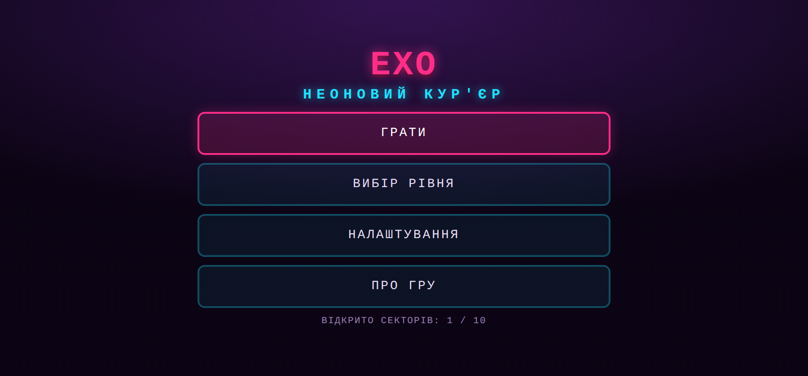
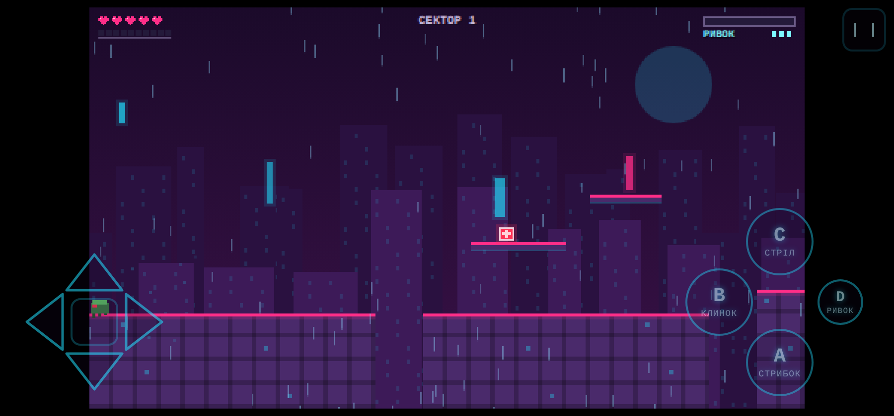
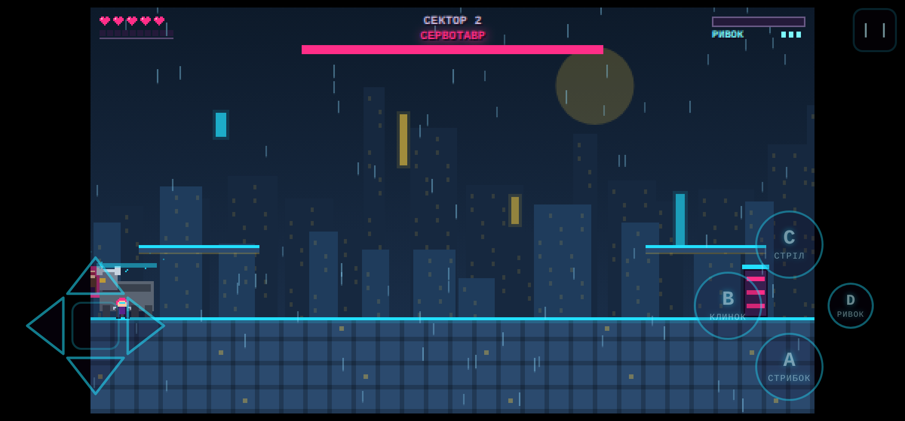
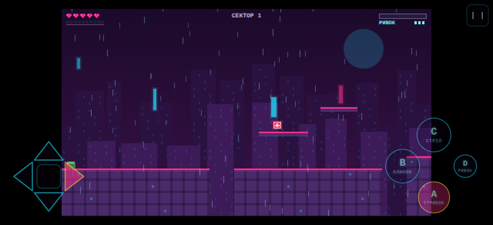

# ЕХО · НЕОНОВИЙ КУР'ЄР

Піксельний кіберпанк-платформер в **одному файлі** [`index.html`](index.html).
Ні бібліотек, ні CDN, ні зовнішніх картинок і звуків: уся графіка малюється
процедурно на `<canvas>`, увесь звук синтезується WebAudio. Відкрий файл у
браузері — гра працює офлайн одразу.

| | |
|---|---|
|  |  |
|  |  |

* Роздільність рендеру **480×270**, цілочисельний масштаб у фізичних пікселях + letterbox, `imageSmoothingEnabled = false`.
* Тільки горизонтальна орієнтація, керування — хрестовина зі стрілок + кнопки дій, повний мультитач.
* 10 секторів, 9 типів ворогів з елітними версіями, 5 босів із фазами й телеграфами атак.
* Фіксований крок фізики 1/60 с з акумулятором, `dt` обмежений 0,25 с, пауза при згортанні.

## Як запустити

```bash
# просто відкрити файл
xdg-open index.html            # Linux
start index.html               # Windows
# або підняти локальний сервер
python3 -m http.server 8000    # http://localhost:8000/neonrunner/
```

## Керування

| Дія | Телефон | Клавіатура |
|---|---|---|
| Рух | стрілки **←/→** на хрестовині (150×150 px, фіксована, 20 px від краю) | `A`/`D`, `←`/`→` |
| Стрибок | стрілка **↑** або кнопка **A** | `W`, `↑`, `Пробіл`, `K` |
| Подвійний стрибок | другий тап по **↑**/**A** уже в повітрі | те саме |
| Присісти | стрілка **↓** | `S`, `↓` |
| Зістрибнути крізь платформу | тримати **↓** 0,3 с | тримати `S`/`↓` |
| Клинок «Арк-тесак» | кнопка **B** | `J` |
| Рейкострил | кнопка **C** (утримання — заряд) | `L` |
| Ривок | окрема кнопка **D** | `Shift` |
| Пауза | кнопка в кутку | `Esc`, `P` |

Хрестовина тримає **ковзання** (палець можна вести з ← на → не відриваючи) і
**діагоналі** (←/→ разом з ↑). Хітбокс кожної стрілки на 25 % більший за
намальований трикутник, тож промазати важко. Кнопки A/B/C — 68 px діаметром із
відступом 18 px, розставлені ромбом; D (ривок) — мала кнопка на четвертій вершині ромба.

Розмір керування (S/M/L), прозорість (30–90 %), дзеркалення для лівші, гучність
звуку й музики та вібрація — у налаштуваннях; усе зберігається в `localStorage`
(у `try/catch`). Числа фізики та розміри керування зібрані в об'єкті `CONFIG`
на початку `index.html` — їх можна крутити, не шукаючи по коду.

## Архітектура коду

Один файл, послідовні секції, кожна пронумерована коментарем:

| # | Секція | Що робить |
|---|---|---|
| 0 | `CONFIG` | вся фізика (гравітація, стрибок, біг, ривок) і розміри керування одним об'єктом із коментарями; далі `BL` (клинок), `RG` (рейкострил), утиліти, детермінований ГПВЧ |
| 1 | `Store` | збереження прогресу й налаштувань у `localStorage`, усе в `try/catch` |
| 2 | `Sfx` | синтез звуку WebAudio (осцилятори + буфер шуму), контекст створюється після першої взаємодії |
| 3 | `Music` | процедурний луп під тему рівня, планування нот із випередженням 0,25 с |
| 4 | `buzz` | вібрація з вимикачем у налаштуваннях |
| 5 | Графічне ядро | масштаб канви, спрайти з масивів рядків, текст, частинки, кільця, камера з тремтінням |
| 6 | `LEVELS` | 10 тайлових карт як масиви рядків (згенеровані `tools/genlevels.py`) |
| 7 | `world` | розбір карти, доступ до тайлів, AABB-колізії `moveX`/`moveY` (окремо по осях), рухомі платформи |
| 8 | `Input` | мультитач (хрестовина + кнопки A/B/C/D) і дублююча клавіатура, фронти натискань |
| 9 | Пули | кулі, вороги, аптечки, промені, телеграфи — масиви з компактуванням |
| 10 | Герой | стан, стрибок з coyote/буфером/подвійним, ривок, обидві зброї, парирування, розряд, активне перезаряджання |
| 11 | Вороги | 9 типів, у кожного власний скінченний автомат; елітні версії |
| 12 | Кулі й промені | рух, влучання, парирування, зони шкоди |
| 13 | Боси | спільний каркас (фази, телеграфи, вразливості) + 5 окремих автоматів |
| 14 | Теми й фон | палітри 10 локацій, паралакс, погода (дощ, пелюстки, глітчі, іскри) |
| 15 | Рендер сутностей | герой, вороги, боси, ефекти, темрява метро |
| 16 | HUD | серця, шкала клинка, шкала тепла з зоною активного перезаряджання, смуга боса |
| 17 | Екрани | меню, вибір рівня, налаштування, пауза, смерть, фінал (DOM поверх канви) |
| 18 | Цикл | фіксований крок 1/60 с з акумулятором, обмеження `dt`, мікрозупинки на влучаннях |
| 19 | Старт | ініціалізація, розблокування звуку, пауза за `visibilitychange`, лок орієнтації |

## Звіт за планкою якості

Усі пункти перевірені автотестами у справжньому Chromium (див. нижче).

1. **Провалювання крізь підлогу й застрягання в кутах.** Рух розділено по осях
   (`moveX` → `moveY`), кожен зсув розбивається на підкроки ≤ 6 px, тобто на
   максимальній швидкості падіння (420 px/с ≈ 7 px за кадр) тіло не може
   «перестрибнути» тайл. Односторонні платформи спрацьовують лише при русі вниз
   і лише якщо низ тіла був вище краю. Фаззинг 10 рівнів по 25 с випадкового
   введення — жодного застрягання чи провалу.
2. **Мультитач.** `tools/mechanics.mjs` через CDP тисне три пальці одночасно
   (джойстик + A + C) і перевіряє, що герой у цей момент біжить, стрибає й стріляє. ✔
3. **Витоки пам'яті.** Усі масиви компактуються (swap-remove) і мають стелю:
   кулі ≤ 90, частинки ≤ 260, телеграфи ≤ 40, кільця ≤ 30, зони ≤ 30, слід гравця ≤ 70.
   Після 25 с бою на кожному рівні розміри масивів у межах (тест друкує їх).
   Кожен звуковий вузол від'єднується в `onended`.
4. **Прохідність усіх 10 рівнів.** Математика (з `CONFIG`): висота стрибка **66 px
   = 4,1 тайла** (виміряно в грі; за формулою 67,1 px, дискретний крок 1/60 с
   «з'їдає» 3,7 px), час у повітрі 0,652 с, довжина стрибка з розбігу
   **91 px = 5,7 тайла**, подвійний стрибок додає ще ~39 px. Карти будуються з
   обмеженнями «прірва ≤ 3 тайли (48 px), уступ угору ≤ 2 тайли (32 px)».
   Перевірок дві й обидві зелені: `tools/gaps.mjs` міряє кожен розрив між
   поверхнями проти планки 85 px по горизонталі та 66 px угору (без урахування
   подвійного стрибка — тобто із запасом), а `tools/reach.mjs` будує граф
   поверхонь **справжньою фізикою гри** (реальні `moveX`/`moveY`) і пошуком у
   ширину доводить, що з точки появи досяжні і чекпоінт, і вихід. ✔
5. **Телеграфи босів.** Кожна атака має фазу попередження 0,4–0,6 с із миготливою
   рамкою або підсвіченою зоною: СЕРВОТАВР риє копитом 0,6 с перед ривком і присідає
   0,5 с перед стрибком; МАТКА-РІЙ підсвічує місце падіння бомби 0,5 с; ХРОНОКЛИНОК
   показує привид місця телепорту 0,45 с і замахується 0,5 с; ГЛІТЧ-ЯДРО малює лінії
   лазерів 0,55 с; АРХІТЕКТОР — 0,5 с на залп, 0,6 с на ривок і на променевий замах,
   0,9 с попередження перед обвалом підлоги. Контактна шкода — 1, подвійна (2) буває
   тільки під час телеграфованого ривка.
6. **Смерть / респавн / перехід між рівнями.** `startLevel` повністю перебудовує
   світ: `clearEntities()`, `bossReset()`, скидання зон, тіней, сліду гравця,
   мікрозупинки й таймерів. Тест перевіряє, що після смерті на одному рівні й
   старту іншого вороги свої, HP повне, а «Перезапустити з чекпоінта» ставить героя
   саме на чекпоінт. ✔
7. **Помилки в консолі.** Усі тести слухають `pageerror` і `console.error`; за повний
   прогін (10 рівнів + 5 босів + меню + мультитач) — нуль помилок і нуль `undefined`
   у рендері. ✔
8. **Старт із першого тапу.** `AudioContext` створюється в обробнику першої
   взаємодії (`pointerdown`/`keydown`/`touchstart`), далі `resume()` на кожному
   дотику. Тест натискає «Грати» як користувач і перевіряє, що гра одразу в стані `play`. ✔
9. **Згортання застосунку.** `dt` кадру обмежений 0,25 с, за кадр не більше 6 кроків
   фізики, акумулятор скидається; `visibilitychange` ставить гру на паузу й зупиняє
   музику, `pagehide` — теж. Стрибка фізики після повернення немає.
10. **Читабельність.** ~3800 рядків JS із коментарями українською, поділені на 20
    пронумерованих секцій. Продуктивність: крок фізики 0,03–0,04 мс, рендер
    0,87–1,11 мс на кадр (Chromium, 480×270) — тобто ≈ 1 мс із 16,6 мс бюджету,
    запас на слабкі телефони понад десятикратний.

### Як прогнати перевірки

```bash
npm i -D playwright        # або скористатися глобальним playwright
node tools/gaps.mjs        # геометрія: кожен розрив проти 85 px / 66 px
node tools/reach.mjs       # прохідність усіх 10 рівнів справжньою фізикою
node tools/boss2.mjs       # арена Сервотавра: розрахунок і реальне ухилення від хвилі
node tools/smoke.mjs       # фаззинг рівнів, боси, витоки, помилки консолі
node tools/mechanics.mjs   # зброя, парирування, тепло, coyote/буфер, мультитач
node tools/bosskill.mjs    # чи вбивається кожен бос звичайною зброєю
node tools/flow.mjs        # наскрізний прохід: меню → гра → пауза → вихід → смерть
python3 tools/genlevels.py # перегенерувати карти (з перевіркою геометрії)
sh tools/check.sh          # синтаксис JS усередині index.html
```

## Збірка APK через Capacitor

### 0. Що поставити

| Компонент | Windows | Linux |
|---|---|---|
| Node.js LTS (20+) | [nodejs.org](https://nodejs.org) або `winget install OpenJS.NodeJS.LTS` | `sudo apt install nodejs npm` (або nvm) |
| JDK 17 | `winget install Microsoft.OpenJDK.17` | `sudo apt install openjdk-17-jdk` |
| Android Studio + SDK 34 | [developer.android.com/studio](https://developer.android.com/studio) | те саме |

В Android Studio: **SDK Manager → SDK Platforms → Android 14 (API 34)** і
**SDK Tools → Android SDK Build-Tools 34, Platform-Tools, Command-line Tools**.

Змінні середовища:

```powershell
# Windows (PowerShell, від імені користувача)
setx ANDROID_HOME "$env:LOCALAPPDATA\Android\Sdk"
setx JAVA_HOME "C:\Program Files\Microsoft\jdk-17.0.11.9-hotspot"
setx PATH "$env:PATH;$env:LOCALAPPDATA\Android\Sdk\platform-tools;$env:LOCALAPPDATA\Android\Sdk\cmdline-tools\latest\bin"
```

```bash
# Linux (додати у ~/.bashrc і виконати source ~/.bashrc)
export ANDROID_HOME="$HOME/Android/Sdk"
export JAVA_HOME="/usr/lib/jvm/java-17-openjdk-amd64"
export PATH="$PATH:$ANDROID_HOME/platform-tools:$ANDROID_HOME/cmdline-tools/latest/bin"
```

Перевірка: `node -v`, `java -version` (має бути 17), `adb version`.

### 1. Проєкт

```bash
mkdir neonrunner-apk && cd neonrunner-apk
npm init -y
npm i @capacitor/core
npm i -D @capacitor/cli
npm i @capacitor/android

npx cap init "NeonRunner" "com.example.neonrunner" --web-dir=www

mkdir www
cp /шлях/до/neonrunner/index.html www/index.html      # Linux/macOS
# copy \шлях\до\neonrunner\index.html www\index.html  # Windows
```

`capacitor.config.json` після `init` доведи до такого вигляду:

```json
{
  "appId": "com.example.neonrunner",
  "appName": "NeonRunner",
  "webDir": "www",
  "server": { "androidScheme": "https" },
  "android": { "backgroundColor": "#0b0413" }
}
```

### 2. Android-платформа

```bash
npx cap add android
npx cap sync
```

### 3. Правки в `android/app/src/main/AndroidManifest.xml`

Дозвіл на вібрацію — усередині `<manifest>`, поруч із іншими `uses-permission`:

```xml
<uses-permission android:name="android.permission.VIBRATE" />
```

Активність — додати орієнтацію та обробку змін конфігурації:

```xml
<activity
    android:name=".MainActivity"
    android:exported="true"
    android:launchMode="singleTask"
    android:screenOrientation="sensorLandscape"
    android:configChanges="orientation|keyboardHidden|keyboard|screenSize|locale|smallestScreenSize|screenLayout|uiMode|density"
    android:theme="@style/AppTheme.NoActionBar">
```

Повний екран — `android/app/src/main/res/values/styles.xml`:

```xml
<style name="AppTheme.NoActionBar" parent="Theme.AppCompat.DayNight.NoActionBar">
    <item name="windowActionBar">false</item>
    <item name="windowNoTitle">true</item>
    <item name="android:background">@null</item>
    <item name="android:windowFullscreen">true</item>
    <item name="android:windowLayoutInDisplayCutoutMode">shortEdges</item>
</style>
```

Щоб системні панелі не виринали, у `android/app/src/main/java/.../MainActivity.java`
після `super.onCreate(savedInstanceState);` додай:

```java
androidx.core.view.WindowCompat.setDecorFitsSystemWindows(getWindow(), false);
androidx.core.view.WindowInsetsControllerCompat c =
    new androidx.core.view.WindowInsetsControllerCompat(getWindow(), getWindow().getDecorView());
c.hide(androidx.core.view.WindowInsetsCompat.Type.systemBars());
c.setSystemBarsBehavior(
    androidx.core.view.WindowInsetsControllerCompat.BEHAVIOR_SHOW_TRANSIENT_BARS_BY_SWIPE);
```

Після будь-яких змін у `www/`: `npx cap sync`.

### 4. Debug-APK

```bash
cd android
./gradlew assembleDebug          # Linux/macOS
gradlew.bat assembleDebug        # Windows
```

Готовий файл: **`android/app/build/outputs/apk/debug/app-debug.apk`**

Встановити на телефон (увімкнено «Налагодження по USB»):

```bash
adb install -r app/build/outputs/apk/debug/app-debug.apk
```

### 5. Release-APK із підписом

Створити сховище ключів (один раз, зберігай його й пароль — без них оновлення застосунку неможливе):

```bash
keytool -genkey -v -keystore neonrunner.keystore -alias neonrunner \
        -keyalg RSA -keysize 2048 -validity 10000
```

Покласти `neonrunner.keystore` у `android/app/`, а поруч створити `android/keystore.properties`:

```properties
storeFile=neonrunner.keystore
storePassword=ВАШ_ПАРОЛЬ
keyAlias=neonrunner
keyPassword=ВАШ_ПАРОЛЬ
```

У `android/app/build.gradle` перед `android { ... }`:

```gradle
def keystorePropertiesFile = rootProject.file("keystore.properties")
def keystoreProperties = new Properties()
if (keystorePropertiesFile.exists()) {
    keystoreProperties.load(new FileInputStream(keystorePropertiesFile))
}
```

Усередині `android { ... }`:

```gradle
signingConfigs {
    release {
        storeFile file(keystoreProperties['storeFile'])
        storePassword keystoreProperties['storePassword']
        keyAlias keystoreProperties['keyAlias']
        keyPassword keystoreProperties['keyPassword']
    }
}
buildTypes {
    release {
        signingConfig signingConfigs.release
        minifyEnabled false
        proguardFiles getDefaultProguardFile('proguard-android-optimize.txt'), 'proguard-rules.pro'
    }
}
```

Збірка:

```bash
cd android
./gradlew assembleRelease
```

Готовий файл: **`android/app/build/outputs/apk/release/app-release.apk`**

Перевірити підпис і, за потреби, вирівняти:

```bash
$ANDROID_HOME/build-tools/34.0.0/apksigner verify --verbose app/build/outputs/apk/release/app-release.apk
$ANDROID_HOME/build-tools/34.0.0/zipalign -c -v 4 app/build/outputs/apk/release/app-release.apk
```

Для Google Play замість APK потрібен bundle: `./gradlew bundleRelease` →
`android/app/build/outputs/bundle/release/app-release.aab`.

Не забудь додати `keystore.properties` і `*.keystore` у `.gitignore`.

## Прийняті рішення

* **Шрифт** — системний моноширинний на канві: гра українською, а власний
  піксельний шрифт довелося б малювати для всієї кирилиці; при цілочисельному
  масштабуванні канви літери все одно виходять піксельними.
* **Спрайти** — герой намальований масивами рядків (12×15, 9 кадрів), вороги й
  боси малюються прямокутниками процедурно: так їх легше анімувати (замах,
  щит, крила, фази боса) і файл лишається компактним.
* **Прірва не вбиває миттєво** — забирає 1 HP і повертає на чекпоінт (у бою з
  босом — до входу в арену). Смерть настає, лише коли серця скінчилися.
* **Рухомі платформи односторонні** (стояти можна лише зверху) — це прибирає
  цілий клас багів із розчавлюванням між платформою і стіною.
* **Ривок у повітрі обнуляє вертикальну швидкість** — так ним зручно рятуватися
  над прірвою, і це робить «трюкові» стрибки з віддачею рейкострила керованими.
* **Тап по `C` стріляє одразу**, а утримання 0,8 с додатково заряджає промінь:
  так звичайний постріл лишається чуйним, а заряд не заважає.
* Назви, персонажі, корпорації, музика й шрифти — оригінальні; жодних відсилань
  до наявних франшиз.
